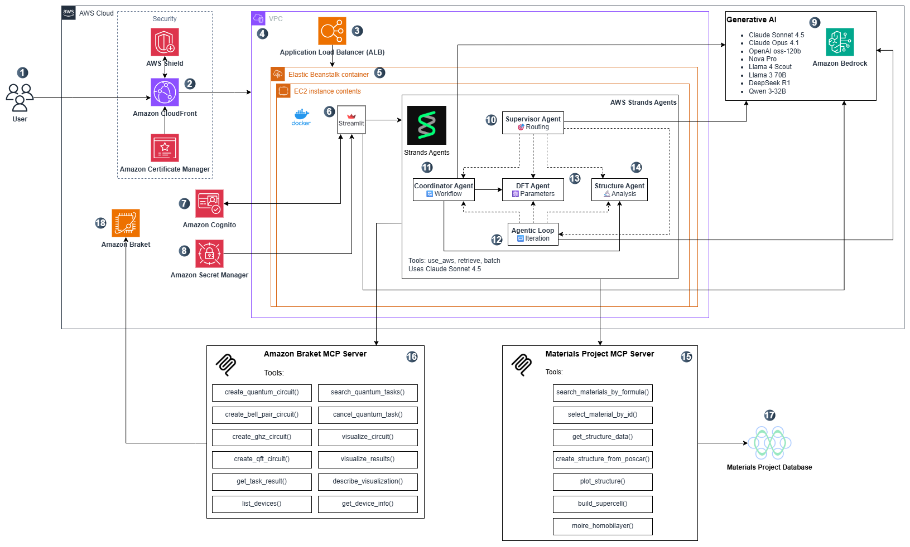

# Architecture Overview

## Architecture Deep Dive

### Architecture



## AWS Service Interaction Workflow

**User Request Flow:**
CloudFront CDN routes users to Application Load Balancer → Elastic Beanstalk hosts Streamlit app → Cognito authenticates users with JWT tokens.

**AI Processing Chain:**
Secrets Manager provides API keys → Streamlit app calls AWS Bedrock (8 LLM models) → Strands Agents coordinate multi-agent workflows based on query type.

**Data Integration:**
Qiskit Framework: Materials Project MCP server retrieves crystallographic data → Braket Framework: Amazon Braket MCP provides quantum device information → All responses stream back through the same path to users.

### Description

1. **User Interface** - Users interact with the Streamlit web application through their browser.
2. **CloudFront CDN** - Global content delivery network provides SSL termination and caching.
3. **Application Load Balancer** - Distributes incoming traffic across multiple Elastic Beanstalk instances.
4. **VPC (Virtual Private Cloud)** - Secure network environment containing all AWS resources.
5. **Elastic Beanstalk** - Platform-as-a-Service hosting the Streamlit application in Docker containers.
6. **Streamlit Application** - Main web interface that orchestrates all user interactions and workflows.
7. **AWS Cognito** - Enterprise authentication service handling user login, signup, and email verification.
8. **AWS Secrets Manager** - Secure storage for API keys and configuration credentials.
9. **AWS Bedrock** - Foundation model service providing access to 8 LLM models across us-east-1 and us-west-2 regions.
10. **Strands Supervisor Agent** - Main coordinator that manages and creates other specialized agents.
11. **Strands Coordinator Agent** - Orchestrates multi-agent workflows and connects to DFT and Structure agents.
12. **Strands Agentic Loop** - Iterative processing engine that creates agent instances for complex workflows.
13. **DFT Agent** - Specialized agent for density functional theory calculations and parameters.
14. **Structure Agent** - Handles crystal structure analysis and 3D visualization generation.
15. **Materials Project MCP Server** - Model Context Protocol server interfacing with Materials Project database.
16. **Braket MCP Server** - MCP server providing Amazon Braket quantum computing integration.
17. **Materials Project Database** - External database containing crystal structures and electronic properties.
18. **Amazon Braket Service** - AWS quantum computing service for device information and circuit execution.

## Model Architecture

### LLM Models
The application provides access to 8 foundation models through [AWS Bedrock](https://aws.amazon.com/bedrock/), each implemented as a separate class inheriting from `BaseModel`:

- **Nova Pro** (`nova_pro_model.py`) - Amazon's multimodal model
- **Llama 3 70B** (`llama3_model.py`) - Meta's large language model  
- **Llama 4 Scout** (`llama4_model.py`) - Meta's instruction-tuned model
- **Claude Sonnet 4.5** (`claude_sonnet_model.py`) - Anthropic's advanced reasoning model
- **Claude Opus 4.1** (`claude_opus_model.py`) - Anthropic's complex analysis model
- **OpenAI GPT OSS** (`openai_model.py`) - OpenAI's open-source model
- **Qwen 3-32B** (`qwen_model.py`) - Alibaba's reasoning model
- **DeepSeek R1** (`deepseek_model.py`) - DeepSeek's problem-solving model

## AWS Strands Agents

The platform uses AWS Strands Agents SDK for intelligent multi-agent workflows. The Supervisor Agent coordinates with specialized agents using dashed lines (management relationships), while the Coordinator Agent directly communicates with DFT and Structure agents using solid lines (direct communication). All agents that perform reasoning connect to AWS Bedrock with solid lines.

For detailed agent workflows and communication patterns, see [Agentic Architecture Guide](agentic-architecture.md).

## MCP Servers

Two specialized MCP servers provide external data integration:

- **Materials Project MCP**: Retrieves crystal structures, electronic properties, and generates 3D visualizations from the Materials Project database
- **Braket MCP**: Provides quantum circuit analysis, device information, and educational quantum algorithm examples

For complete MCP server documentation, see [Materials Project MCP Integration](materials-project-mcp-integration.md) and [Braket Integration](braket-integration.md).

## Data Flow

### Query Processing Flow
1. **User Input** → Streamlit interface captures query
2. **Framework Selection** → Routes to Qiskit or Braket workflow
3. **Model Selection** → Chooses appropriate LLM model
4. **Agent Processing** → Strands agents handle specialized tasks
5. **MCP Integration** → Retrieves external data (Materials Project/Braket)
6. **Response Generation** → LLM generates quantum code and explanations
7. **Visualization** → 3D structures and circuit diagrams rendered

### Framework Routing Logic
```python
if framework == "Qiskit Framework":
    # Use Materials Project MCP + Strands agents
    agent = supervisor_agent
    mcp_data = materials_project_mcp.get_structure(material_id)
    
elif framework == "Braket Framework":
    # Use Braket MCP directly
    braket_data = braket_mcp.create_circuit(query)
```

