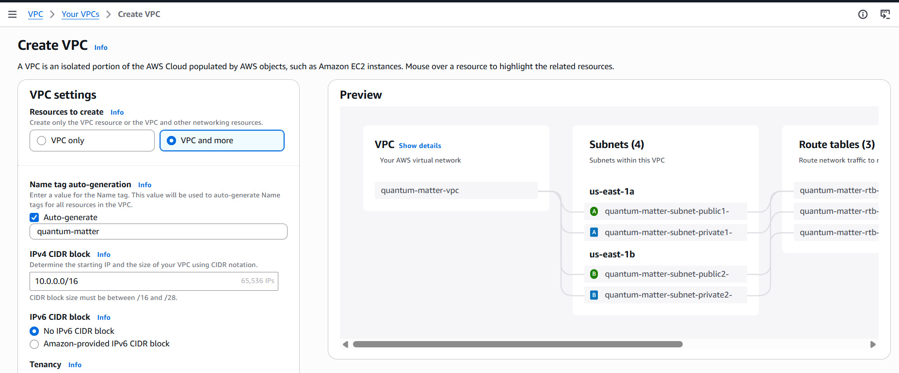
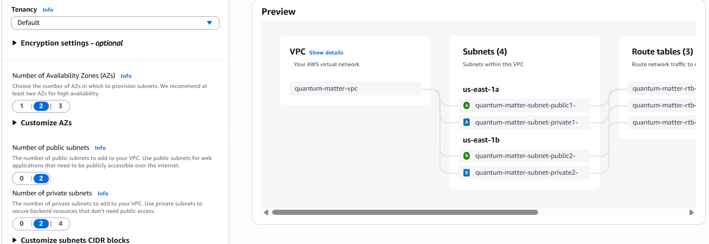
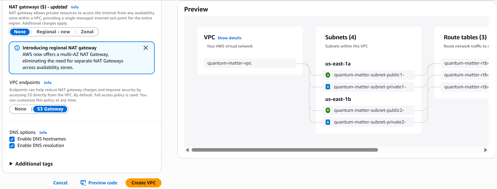

# Deployment Guide

## Quick Navigation
- [Prerequisites](#prerequisites)
- [Local Development (Optional)](#local-development-optional)
- [AWS Deployment (25 min)](#aws-deployment)
  - [Phase 1: Setup AWS Resources](#phase-1-setup-aws-resources-10-minutes)
  - [Phase 2: Deploy Application](#phase-2-deploy-application-15-minutes)
  - [Phase 3: Optional Enhancements](#phase-3-optional-enhancements)
- [Security Measures](#security-measures-implemented)
- [Troubleshooting](#troubleshooting)

## Prerequisites

### AWS Account Setup
Before starting, you need an AWS account with proper access:

1. **Create AWS Account**: Visit [aws.amazon.com](https://aws.amazon.com/) and create a free account
2. **Install AWS CLI**: Follow the [AWS CLI installation guide](https://docs.aws.amazon.com/cli/latest/userguide/getting-started-install.html)
3. **Configure SSO**: Run `aws configure sso` or see [AWS SSO configuration guide](https://docs.aws.amazon.com/cli/latest/userguide/sso-configure-profile-token.html)

### Required Tools
- **Python 3.12+**: Download from [python.org](https://www.python.org/downloads/)
- **Materials Project API Key**: Register at [materialsproject.org](https://materialsproject.org/) for free API access

## Overview
**Local Development (Optional)**: Test locally with demo authentication  
**AWS Deployment**: Deploy with enterprise authentication, SSL, and global CDN

## Local Development (Optional)

**Required for both Local and AWS deployment:**
```bash
# Clone and setup
git clone <repository-url>
cd Multi-Agent-Quantum-Materials-Assistant
pip install -r requirements.txt

# Set AWS profile FIRST (required for setup scripts)
# Linux/Mac:
export AWS_PROFILE=your-profile-name
# Windows PowerShell:
$env:AWS_PROFILE="your-profile-name"

# Setup secrets (uses AWS credentials)
python -m setup.setup_secrets
```

**Local testing only:**
```bash
python run_local.py
```

**Login**: Username: `demo`, Password: `quantum2025`

## AWS Deployment

**Order**: Deploy app first, then add optional features

## Phase 1: Setup AWS Resources (10 minutes)

**Supported Regions:** Deploy in `us-east-1` or `ca-central-1` (both fully tested). The application automatically detects and uses your deployment region.

### Step 1: Create VPC (if needed)
**Skip this step if you already have a VPC**

Setting up a VPC:
1. **AWS Console → VPC → Create VPC**
2. **Resources to create**: VPC and more
3. **Name tag**: quantum-matter
4. **IPv4 CIDR**: 10.0.0.0/16
5. **IPv6 CIDR block**: No IPv6 CIDR block
6. **Tenancy**: Default
7. **Number of Availability Zones (AZs)**: 2
8. **Number of public subnets**: 2
9. **Number of private subnets**: 0
10. **NAT gateways**: None
11. **VPC endpoints**: S3 Gateway
12. **DNS options**: Keep defaults (both enabled)
13. **VPC encryption control**: None
14. **Click "Create VPC"**

Here is how the configuration should look like:




### Step 2: Configure Secrets
**If you skipped Local Development section, run these commands:**
```bash
# Clone and setup (if not done already)
git clone <repository-url>
cd Multi-Agent-Quantum-Materials-Assistant
pip install -r requirements.txt

# Set AWS profile FIRST (required for setup scripts)
# Linux/Mac:
export AWS_PROFILE=your-profile-name
# Windows PowerShell:
$env:AWS_PROFILE="your-profile-name"

# Setup secrets (uses AWS credentials)
python -m setup.setup_secrets
```

### Step 3: Create IAM Roles
**Create 2 [IAM roles](https://docs.aws.amazon.com/IAM/latest/UserGuide/id_roles.html) in AWS Console → IAM → Roles:**

**A. EC2 Instance Profile Role**
- Name: `aws-elasticbeanstalk-ec2-role`
- Trusted entity: **EC2**
- [AWS managed policies](https://docs.aws.amazon.com/IAM/latest/UserGuide/access_policies_managed-vs-inline.html): `AWSElasticBeanstalkWebTier`, `AWSElasticBeanstalkWorkerTier`, `AWSElasticBeanstalkMulticontainerDocker`, `AmazonBraketFullAccess`, `AmazonBedrockFullAccess`
- Custom [inline policy](https://docs.aws.amazon.com/IAM/latest/UserGuide/access_policies_managed-vs-inline.html) for Secrets Manager:

Begin by opening AWS Console → IAM → Roles → aws-elasticbeanstalk-ec2-role

Select "Roles" under "Access management."
You will see:

In order to add these policies you can select "Add permissions" and then select "Attach Policies".

Now in the search bar enter the folowing policy names and add them.
- `AWSElasticBeanstalkWebTier`
- `AWSElasticBeanstalkWorkerTier`
- `AWSElasticBeanstalkMulticontainerDocker`
- `AmazonBraketFullAccess`
- `AmazonBedrockFullAccess`

Then go back to the Permissions page and select "Add permissions" again but this time select "Create inline policy."

Under "Specify permissions" select the "JSON editor" option and enter the following JSON lines:
```json
{
    "Version": "2012-10-17",
    "Statement": [
        {
            "Effect": "Allow",
            "Action": ["secretsmanager:GetSecretValue"],
            "Resource": "arn:aws:secretsmanager:*:*:secret:materials-project/*"
        }
    ]
}
```
It should look like this:


Then click on the button "Next" on the bottom right corner. 

You will now see the following page:


Enter a policy name (e.g., MaterialsProjectKey) and click "Create policy."

**Required for Admin Authentication**: Custom inline policy for Cognito admin access:

Go back to the Permissions page and select "Add permissions" again and select "Create inline policy."

Under "Specify permissions" select the "JSON editor" option and enter the following JSON lines:

```json
{
    "Version": "2012-10-17",
    "Statement": [
        {
            "Effect": "Allow",
            "Action": [
                "cognito-idp:ListUsers",
                "cognito-idp:AdminDeleteUser",
                "cognito-idp:CreateGroup",
                "cognito-idp:AdminAddUserToGroup",
                "cognito-idp:AdminRemoveUserFromGroup",
                "cognito-idp:ListGroups",
                "cognito-idp:ListUsersInGroup",
                "cognito-idp:AdminListGroupsForUser",
                "cognito-idp:AdminCreateUser",
                "cognito-idp:AdminSetUserPassword"
            ],
            "Resource": "arn:aws:cognito-idp:*:YOUR_ACCOUNT_ID:userpool/*"
        }
    ]
}
```
**Note**: Replace `YOUR_ACCOUNT_ID` with your actual AWS account ID

It should look like this:


Then click on the button "Next" on the bottom right corner. 

You will now see the following page:


Enter a policy name (e.g., CognitoAdminAccess) and click "Create policy."

**B. Service Role**
- Name: `aws-elasticbeanstalk-service-role`
- Trusted entity: **[Elastic Beanstalk](https://docs.aws.amazon.com/elasticbeanstalk/latest/dg/concepts-roles-service.html)**
- AWS managed policies: [`AWSElasticBeanstalkEnhancedHealth`](https://docs.aws.amazon.com/elasticbeanstalk/latest/dg/health-enhanced.html), [`AWSElasticBeanstalkManagedUpdatesCustomerRolePolicy`](https://docs.aws.amazon.com/elasticbeanstalk/latest/dg/environment-platform-update-managed.html)

Begin by opening AWS Console → IAM → Roles → 
aws-elasticbeanstalk-service-role

Select "Roles" under "Access management."
You will see:

In order to add these properties you can select "Add permissions" and then select "Attach Policies".

Now in the search bar enter the folowing policy names and add them so it looks like the example image above.
- `AWSElasticBeanstalkEnhancedHealth`
- `AWSElasticBeanstalkManagedUpdatesCustomerRolePolicy`

## Phase 2: Deploy Application (15 minutes)

### Step 1: Create Deployment Package
```bash
python -m deployment.deploy_fixed_integration
```

### Step 2: Create Elastic Beanstalk Environment
**AWS Console → Elastic Beanstalk → Create application**

1. **Click "Create environment"**


2. **Click "Web server environment"**


3. **Application information:**

   - Application name: `quantum-matter-app`

4. **Environment information:**

   - Environment name: `quantum-matter-env`

5. **Platform:**

   - Platform: **Docker**
   - Platform branch: **Docker running on 64bit Amazon Linux 2023**

6. **Application code:**

   - Source: **Upload your code**
   - Upload ZIP file from Step 1

7. **Configuration presets:**

   - Select: **Single instance**

8. **Configure Service Access:**

   - Service role: `aws-elasticbeanstalk-service-role`
   - EC2 instance profile: `aws-elasticbeanstalk-ec2-role`

9. **Set Up Networking:**

   - VPC: Default VPC (or quantum-matter-vpc if created in Step 1)
   - Public IP address: **Activated**

10. **Configure Instance:**


    - Root volume: **20GB**
    - Instance types: **t3.medium** (minimum), **t3.large** (recommended), **t3.xlarge** (heavy usage)

11. **On the Configure updates, monitoring, and logging page (Step 5 - optional) set these under Environment variables/Enviornment properties:**

Leave the Monitoring, Updates, and Log sections unchanged.
Provide the following under the Environment variables/Enviornment properties section:

**Minimal Initial Configuration (Required):**

| Source | Key | Value |
|--------|-----|-------|
| Plain text | STREAMLIT_SERVER_HEADLESS | true |
| Plain text | STREAMLIT_SERVER_ADDRESS | 0.0.0.0 |
| Plain text | STREAMLIT_SERVER_PORT | 8501 |
| Plain text | AUTH_MODE | demo |
| Plain text | DEMO_USERNAME | demo |
| Plain text | DEMO_PASSWORD | quantum2025 |

**Note:** `setup_cognito.py` (Phase 3) automatically adds 5 Cognito variables and changes `AUTH_MODE` to `cognito`. `setup_cloudfront.py` adds 3 CloudFront security variables.

**✅ Success**: App accessible at EB URL (5-10 minutes)

**🔑 Default Login Credentials:**
If you do not set up Cognito authentication (Phase 3), use these demo credentials:
- **Username**: demo
- **Password**: quantum2025

## Phase 3: Optional Enhancements

### Add Cognito Authentication (Optional)
**Run AFTER successful deployment** (if using AWS SSO, set profile first: `set AWS_PROFILE=your-profile-name`):
```bash
python -m setup.setup_cognito
```
**What this does:**
- Creates Cognito User Pool and App Client with admin-only signup
- Automatically sets EB environment variables
- Configures email verification
- Takes priority over demo credentials
- Enables bootstrap admin system for first-time setup

**Admin Authentication Setup:**
1. **First login**: Use existing account or create an initial account through the Amazon Cognito Console before accessing the bootstrap system
2. **Bootstrap admin**: Click "Become Admin" button (appears only when no admins exist)
3. **Sign out and login**: After becoming admin, sign out and log back in to refresh your session
4. **Admin panel**: Access user management in sidebar after becoming admin
5. **Create users and other admins**: Only admins can create new accounts with temporary passwords

### Add CloudFront Pro + AWS WAF Security (Optional)
**Run AFTER successful deployment:**
```bash
python -m deployment.setup_cloudfront
```
**Enterprise Security Features:**
- **AWS WAF Web Application Firewall** with OWASP Top 10 protection
- **XSS & SQL Injection Protection** - blocks attacks immediately
- **Rate Limiting** - 400 requests/minute per IP (supports ~80 concurrent users)
- **CloudFront Pro tier** - global CDN with 25 WAF rules included
- **Free SSL certificate** - automatic HTTPS encryption
- **DDoS protection** - AWS Shield integration

**Deployment Time**: 15-20 minutes  
**Access**: Secure HTTPS URL displayed in terminal and available in AWS Console → CloudFront → Distributions

**WAF Management:**
- **Monitor Mode**: Rate limiting starts in safe monitor mode (logs violations, allows traffic)
- **Block Mode**: Switch to enforcement mode via AWS WAF console when ready
- **Real-time Monitoring**: View blocked attacks in AWS WAF console
- **Automatic Updates**: AWS continuously updates security rules

## Security Measures Implemented

**Authentication & Access Control:**
- Multi-layer authentication with Amazon Cognito integration
- Secure credential management via AWS Secrets Manager
- IAM role-based access with least privilege principles

**Application Security:**
- Comprehensive input validation and sanitization
- **Multi-layer rate limiting**:
  - Application level: 10 requests per 60 seconds per session
  - Infrastructure level: AWS WAF 400 requests/minute per IP
- **AWS WAF Web Application Firewall** (when CloudFront is deployed):
  - XSS (Cross-Site Scripting) protection
  - SQL injection prevention
  - OWASP Top 10 vulnerability coverage
  - Known bad input filtering
  - Command injection prevention
- HTTP security headers for additional XSS and CSRF protection
- Secure subprocess handling with path validation

**Monitoring & Compliance:**
- Security event audit logging
- CloudWatch monitoring integration
- SSL/TLS encryption via CloudFront

## Troubleshooting

**Deployment Issues:**
- Verify IAM roles and permissions are correctly configured
- Ensure all required files are included in deployment package
- Review application logs in Elastic Beanstalk console
- Check environment variables are properly set

**Model Access Issues:**
- Verify region settings match model availability

**Materials Project Integration:**
- Ensure API key is correctly stored in AWS Secrets Manager
- Test network connectivity to Materials Project API
- Verify MCP server status in application logs

**Authentication Problems:**
- For Cognito: Run setup script after successful EB deployment
- Verify User Pool creation in correct AWS region
- Check demo credentials if Cognito is not configured
- **Admin setup issues**: Ensure EC2 role has Cognito permissions (see Step 2A)
- **Bootstrap admin fails**: Check CloudWatch logs for IAM permission errors
- **User creation fails**: Verify admin has proper Cognito group membership

**CloudFront + WAF Deployment:**
- Allow 15-20 minutes for global distribution and WAF rule propagation
- Test Elastic Beanstalk URL before CloudFront URL
- Verify SSL certificate provisioning status
- **WAF troubleshooting**:
  - Check AWS WAF console for blocked requests
  - Monitor rate limiting in CloudWatch metrics
  - Switch from monitor to block mode when ready
  - Verify Web ACL association with CloudFront distribution